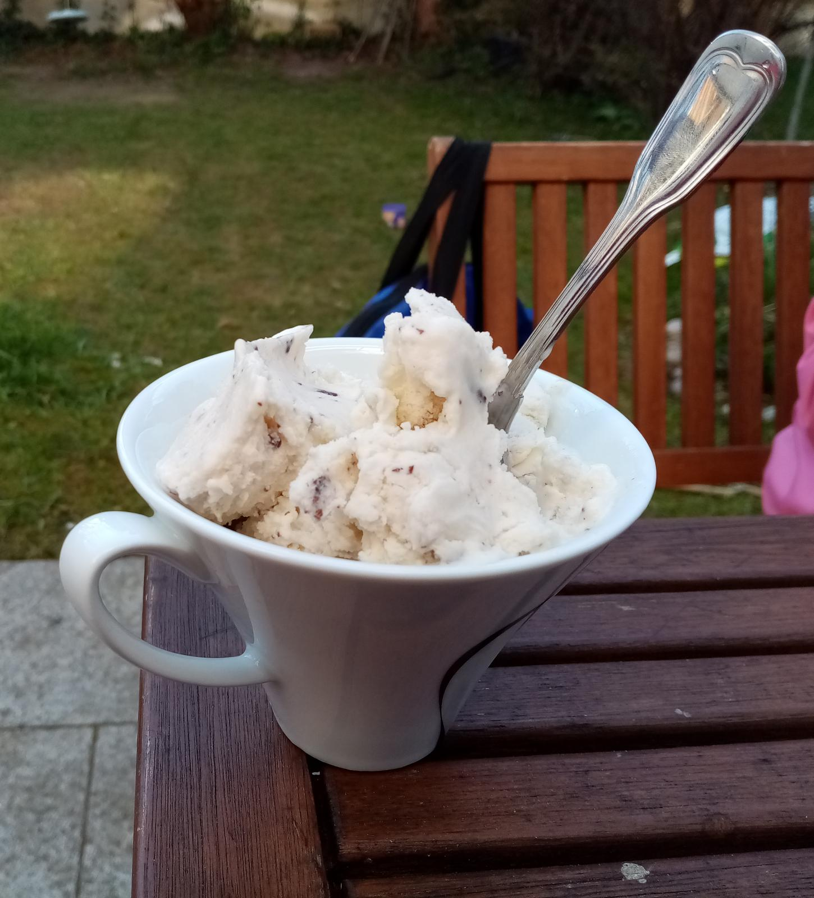

# Banana-Choclate Ice Cream 

For sunny days alone at your balcony.

## Ingredients

+ 2 bananas
+ 300 ml cream
+ 200 ml milk
+ 1 tablespoon honey
+ 2 tablespoons of sugar
+ 50 g grated chocolate

## Tools

+ Ice cream maker
+ Mixer

## Preparation

Get your ice cream maker ready according to it's instructions.

Apart from the grated chocolate put all ingredients in the mixer and mix until you have a homogenious fluid. Then fill it in the ice cream maker and start the agitator. When the ice cream is ready mix the grated chocolate under.
